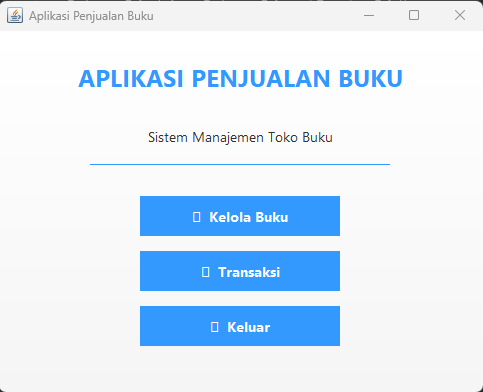
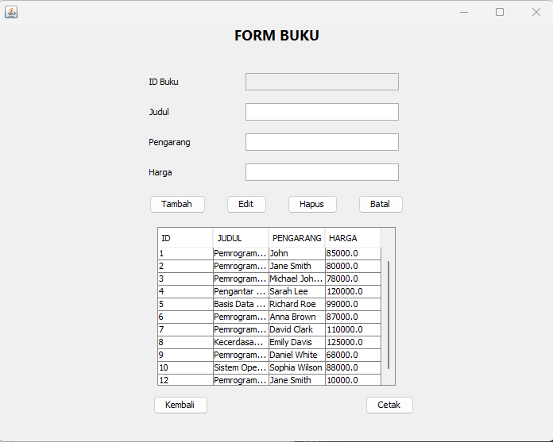
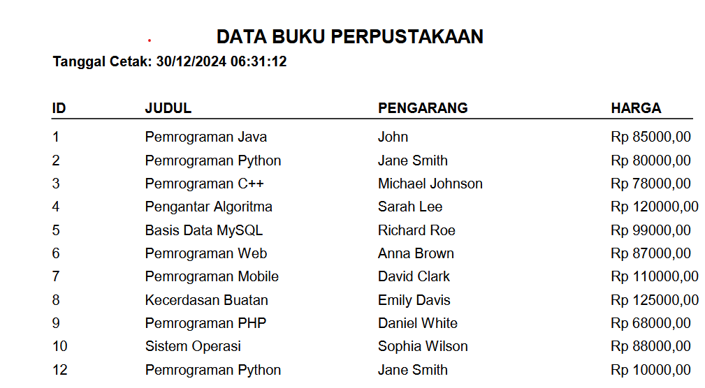
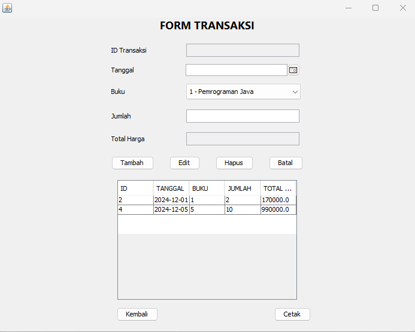
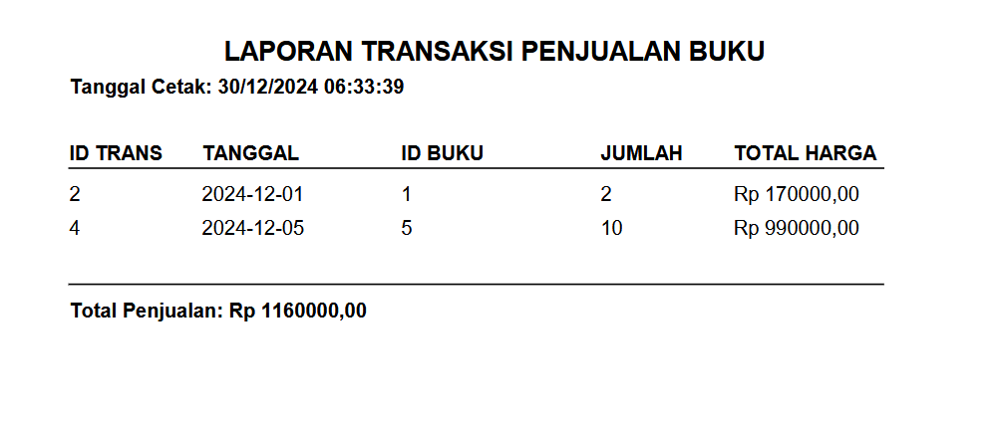

# Aplikasi Penjualan Buku

## Deskripsi
Aplikasi Penjualan Buku sederhana ini adalah sebuah aplikasi berbasis desktop yang digunakan untuk mengelola penjualan buku. Aplikasi ini dirancang untuk mempermudah pengelolaan data buku dan transaksi

## Teknologi yang Digunakan
- **Bahasa Pemrograman**: Java
- **IDE**: NetBeans
- **Database**: MySQL

## Instalasi
1. Clone repository ini ke komputer Anda:
   ```bash
   git clone https://github.com/rahmatlmaulidyh/RahmatulMaulidiyah-2210010391-AplikasiPenjualanBuku.git
   ```
2. Buka proyek di NetBeans.
3. Konfigurasi koneksi database pada file konfigurasi sesuai dengan pengaturan MySQL Anda.
4. Jalankan file utama untuk memulai aplikasi.


## Tangkapan Layar
Berikut adalah beberapa tangkapan layar dari aplikasi:

### Halaman Login

### Halaman Utama


### Form Tambah Buku


### Laporan Buku


### Form Tambah Transaksi


### Laporan Transaksi



## Kontribusi
Kontribusi untuk proyek ini sangat dihargai. Silakan buat pull request

(https://github.com/rahmatlmaulidyh/RahmatulMaulidiyah-2210010391-AplikasiPenjualanBuku/issues).

## Lisensi
Proyek ini dilisensikan di bawah [MIT License](LICENSE).

---

Terima kasih telah menggunakan Aplikasi Penjualan Buku Sederhana
